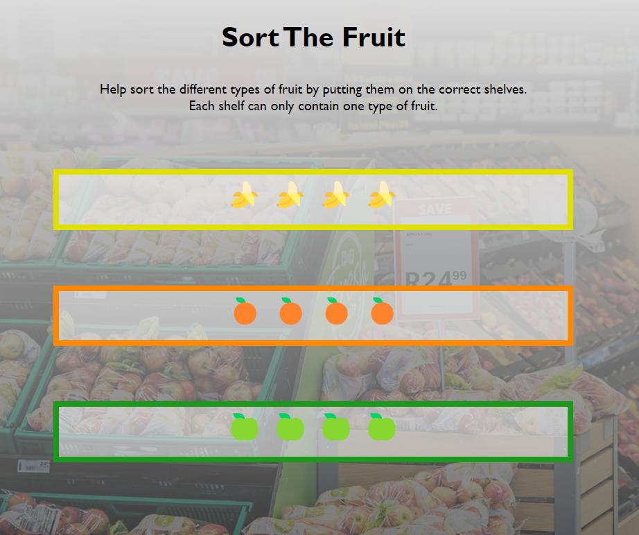

# Sort the Fruit

A simple exercise to teach JavaSpcript loops and DOM interaction

## The Challenge

On this page you can see three empty shelves in a supermarket.

If you take a look inside the [script.js](assets/js/script.js) file, you will find an array of unsorted fruit.

Your job is it to sort the fruit in the array by type and place them all on their respective shelves.

You only need to add code in the script file to achieve this. There is no need to alter any HTML or CSS in this challenge.

Good Luck!

## The Solution

This is what your page should look like after you've written the correct JavaScript code:

## Credits

*bg-supermarket.jpg*: https://virtualbackgrounds.site/background/produce-department-in-a-supermarket/
